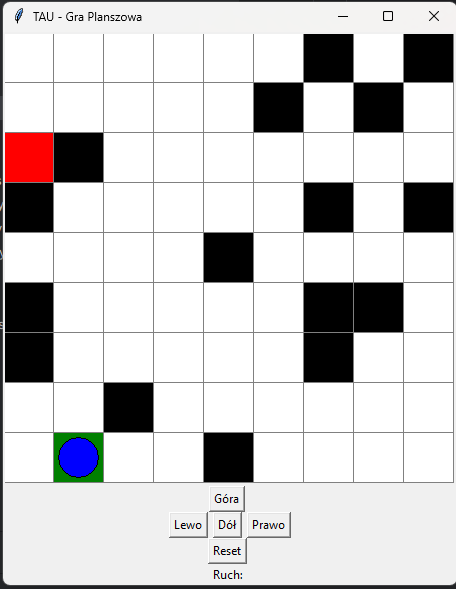
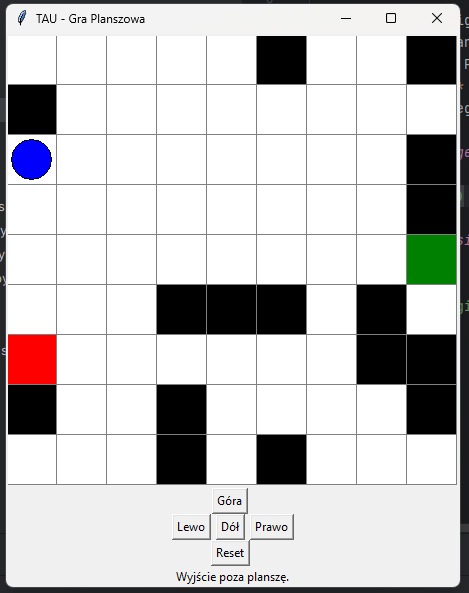

# Lab3-game

Lab3-game is a grid-based Python game where players navigate from a start point to a goal, avoiding obstacles placed on the board. The project includes comprehensive unit tests and a continuous integration pipeline to ensure code quality.

## Features

- **Grid-Based Navigation:** Move your player up, down, left, or right within the board boundaries.
- **Obstacles:** Randomly placed obstacles add challenge to reaching the goal.
- **Start and Goal Points:** Clear start (`A`) and goal (`B`) positions on the board.
- **Unit Testing:** Extensive tests using Python's `unittest` framework.
- **Continuous Integration:** Automated testing with GitHub Actions on every push and pull request.

## Examples of usage




### Clone the Repository

```bash
git clone https://github.com/s24399-pj/TAU.git
cd lab3-game
